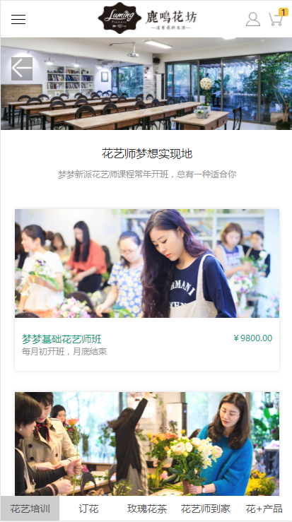
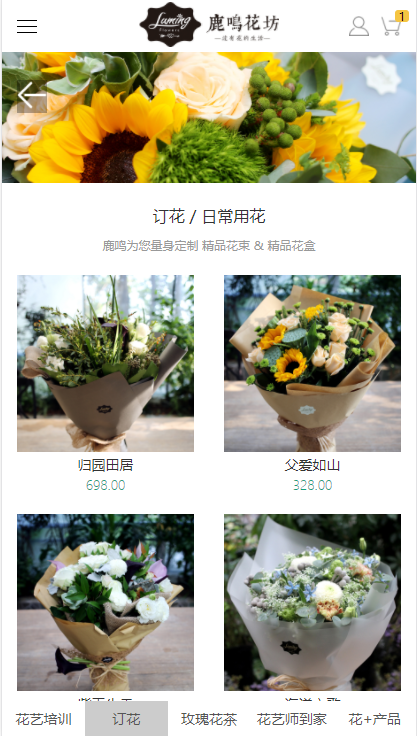
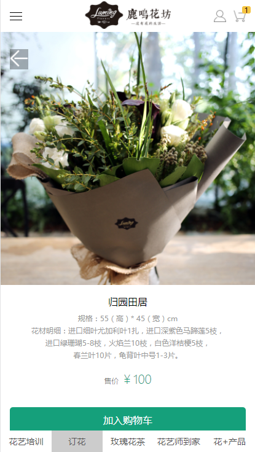
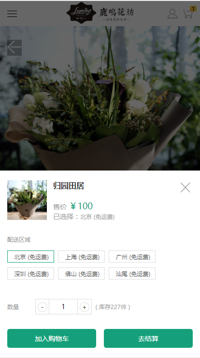
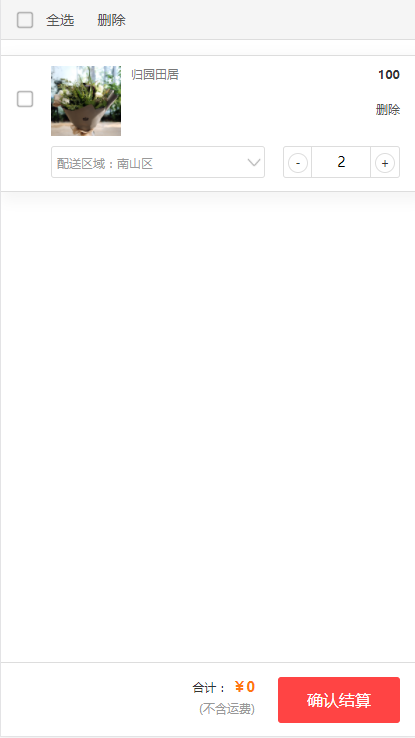
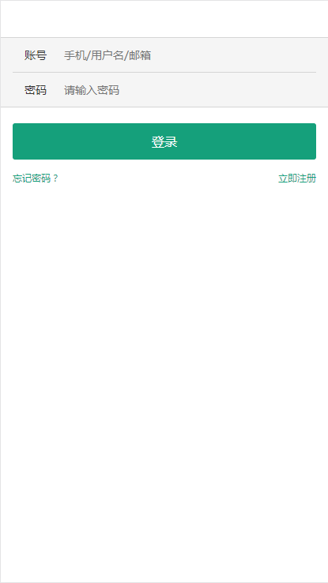

# mengmeng_follow

> 

A Vue.js project


<a href="https://12cm.github.io/mengmeng_follow/dist/index.html" target="_blank">在线演示地址</a><span>(建议在手机或F12手机模式下浏览)</span>

<p>声明：ui设计来自<a href="http://lumingfang.com/pages/training">鹿鸣花坊</a>（非打广告之嫌） ，仅为个人开发学习使用，并无用于任何商业用途，如有侵犯到，可联系本人（QQ:670252095），及时删除, 本项目所有内容及代码仅供私下学习参考, 不得作为其他用途</p>


<p>本项目为vue2.0的上手项目，还未完善，仅有订花页面完成功能，进入订花，点击选择欲购的花进入之后可加入购物车，可进行购物，主要功能块就是购物车</p>


<div>
	<p style="font-size: 1.5rem;font-weight: bold;">界面预览：</p>
	<div>
		
		
		
		
		
		
		
		
		
	</div>
</div>

## Build Setup


``` 
bash


# install dependencies


npm install


# serve with hot reload at localhost:8080

npm run dev


# build for production with minification


npm run build


# build for production and view the bundle analyzer report


npm run build --report


```


For detailed explanation on how things work, checkout the [guide](http://vuejs-templates.github.io/webpack/) and [docs for vue-loader](http://vuejs.github.io/vue-loader).
